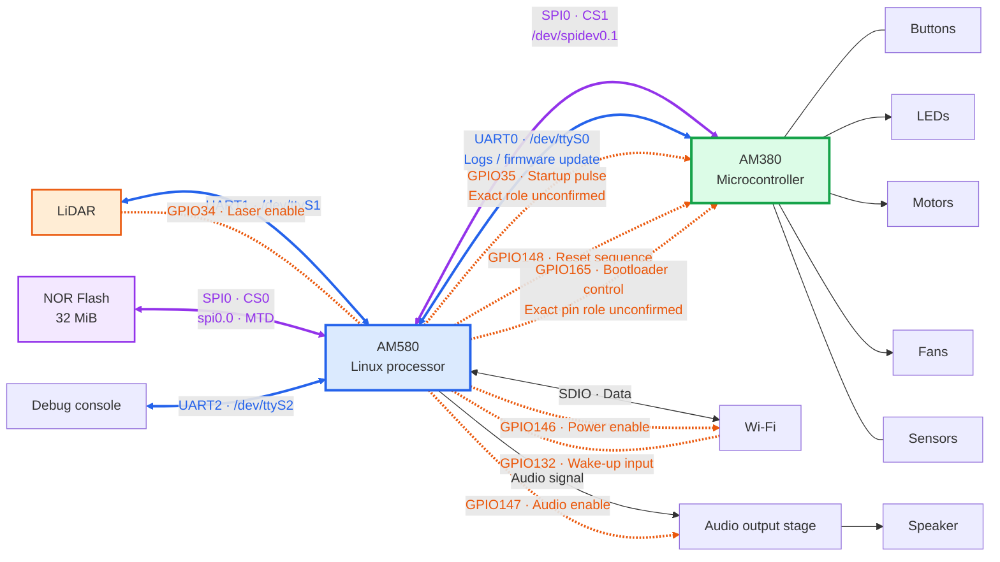

# Hardware connections

GPIO: orange · UART: blue · SPI: purple.

```mermaid
flowchart LR
    LIDAR["LiDAR"]
    CPU["AM580<br/>Linux processor"]
    MCU["AM380<br/>Microcontroller"]
    NOR["NOR Flash<br/>32 MiB"]
    DEBUG["Debug console"]
    WIFI["Wi-Fi"]
    AUDIO["Audio output stage"]
    SPEAKER["Speaker"]
    BUTTONS["Buttons"]
    LEDS["LEDs"]
    MOTORS["Motors"]
    FANS["Fans"]
    SENSORS["Sensors"]

    LIDAR <-->|"UART1 · /dev/ttyS1"| CPU
    LIDAR <-.-|"GPIO34 · Laser enable"| CPU
    NOR <-->|"SPI0 · CS0<br/>spi0.0 · MTD"| CPU
    DEBUG <-->|"UART2 · /dev/ttyS2"| CPU

    CPU <-->|"SPI0 · CS1<br/>/dev/spidev0.1"| MCU
    CPU <-->|"UART0 · /dev/ttyS0<br/>Logs / firmware update"| MCU
    CPU -.->|"GPIO35 · Startup pulse<br/>Exact role unconfirmed"| MCU
    CPU -.->|"GPIO148 · Reset sequence"| MCU
    CPU -.->|"GPIO165 · Bootloader control<br/>Exact pin role unconfirmed"| MCU

    CPU <-->|"SDIO · Data"| WIFI
    CPU -.->|"GPIO146 · Power enable"| WIFI
    CPU <-.-|"GPIO132 · Wake-up input"| WIFI

    CPU -->|"Audio signal"| AUDIO
    CPU -.->|"GPIO147 · Audio enable"| AUDIO
    AUDIO --> SPEAKER

    MCU --- BUTTONS
    MCU --> LEDS
    MCU --> MOTORS
    MCU --> FANS
    MCU --- SENSORS

    linkStyle 0,3,5 stroke:#2563eb,stroke-width:3px,color:#2563eb
    linkStyle 2,4 stroke:#9333ea,stroke-width:3px,color:#9333ea
    linkStyle 1,6,7,8,10,11,13 stroke:#ea580c,stroke-width:3px,color:#ea580c

    style CPU fill:#dbeafe,stroke:#2563eb,stroke-width:3px
    style MCU fill:#dcfce7,stroke:#16a34a,stroke-width:3px
    style LIDAR fill:#ffedd5,stroke:#ea580c,stroke-width:2px
    style NOR fill:#f3e8ff,stroke:#9333ea,stroke-width:2px
```
